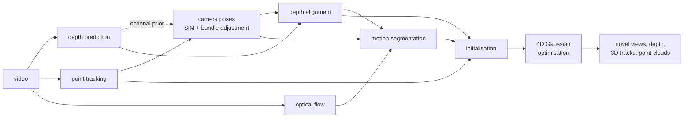

# recon4d

**3D/4D reconstruction from monocular video**: depth prediction, camera pose estimation
and point tracking, fused into a scene of static and moving 3D Gaussians that can be
rendered from any viewpoint at any instant of the video.

[](https://github.com/francoisbarge8/recon4d/actions/workflows/ci.yml)


Everything is PyTorch, written from scratch, and runs on a laptop CPU as well as on a GPU:
the differentiable Gaussian-splatting rasterizer, bundle adjustment, structure-from-motion
on point tracks, depth alignment, motion segmentation, and the 4D scene optimisation. The
project also ships its own benchmark, with exact ground truth for every quantity the
pipeline estimates.

## Pipeline



| stage | what it does | back-ends |
|---|---|---|
| depth | one depth map per frame, up to scale | Depth Anything V2, in-domain U-Net, oracle (+ noise model) |
| tracking | 2D point tracks through the video | KLT, flow chaining, CoTracker3, oracle |
| optical flow | dense motion between frames | DIS, RAFT, oracle |
| camera poses | incremental SfM on the tracks, bundle adjustment | built-in, COLMAP (pycolmap), ground truth |
| depth alignment | makes the depth maps consistent with the poses and with each other | scale / affine + smooth correction field |
| motion segmentation | which pixels and tracks move on their own | rigid-flow residuals |
| scene | static 3D Gaussians + dynamic Gaussians driven by a few SE(3) motion bases | pure-PyTorch rasterizer |

Each stage can be replaced by its ground truth (`oracle`), which is how the benchmark
attributes the final error to depth, tracking or pose estimation. [docs/DESIGN.md](docs/DESIGN.md)
explains every stage and the reasons behind the design.

## What is implemented

* **A differentiable 3D Gaussian splatting rasterizer in pure PyTorch**
  ([rasterizer.py](src/recon4d/gaussians/rasterizer.py)): EWA projection, tile binning,
  front-to-back compositing, exact opacity-aware bounding boxes. Verified against a
  brute-force reference to 1e-10 and by `gradcheck`.
* **A 4D scene model** in the spirit of Shape of Motion: dynamic Gaussians follow a convex
  blend of a few rigid motion bases; 2D tracks supervise motion through rendered 3D
  correspondences; as-rigid-as-possible and smoothness regularisers; adaptive density
  control.
* **Structure-from-motion on point tracks** with a **Levenberg-Marquardt bundle
  adjustment** written in PyTorch (Schur complement, analytic Jacobians checked against
  autograd, Huber loss, optional shared focal length, optional monocular depth prior with
  per-camera scale and shift).
* **Depth alignment** of per-frame monocular depth to the sparse SfM structure (robust
  global fit plus a smooth correction field).
* **Training-free motion segmentation** from the disagreement between observed and rigid
  optical flow.
* **A procedural 4D benchmark with exact ground truth** ([docs/BENCHMARK.md](docs/BENCHMARK.md)):
  ray-traced scenes with moving objects, an oracle answering arbitrary queries (tracks,
  flow, scene flow, surface samples), held-out cameras at the training instants with
  co-visibility masks.
* **Metrics**: PSNR, SSIM, LPIPS; Chamfer distance, accuracy / completeness, F-score;
  ATE, RPE, orientation error; AbsRel / RMSE / delta depth metrics; TAP-Vid tracking
  metrics; 3D trajectory error; temporal consistency (depth temporal error, warping
  error, temporal-difference PSNR).
* **COLMAP interoperability**: export of the front-end as a COLMAP dataset (opens in
  COLMAP's GUI, feeds other 3DGS / NeRF trainers), and COLMAP as an alternative pose
  back-end.

* **TSDF fusion** of posed depth maps with surface extraction as points or as a triangle
  mesh (naive surface nets), in PyTorch ([tsdf.py](src/recon4d/fusion/tsdf.py)).

## Results

Status: the complete benchmark (4 scenes x all variants, at full size) is produced by the
Kaggle notebook and has not been run yet. The numbers below are the runs made so far on a
laptop CPU, on one scene (`sliding`: a spinning crate and a bouncing ball), with the `cpu`
profile (24 frames at 128 x 96, 800 optimisation steps), seed 0. Nothing here is averaged
over scenes or seeds.

**Upper bound of the scene optimisation** (`oracle-all`: ground-truth depth, tracks and
poses, so only the 4D Gaussian optimisation is measured):

| | PSNR | SSIM |
|---|---:|---:|
| held-out frames | 26.47 dB | 0.904 |
| held-out frames, moving objects only | 24.26 dB | 0.860 |
| held-out cameras (co-visible pixels) | 24.96 dB | 0.848 |
| held-out cameras, moving objects only | 22.85 dB | 0.814 |

| geometry and motion | |
|---|---:|
| Chamfer distance, static surface | 3.5 cm |
| F-score @ 10 cm, static surface | 0.974 |
| Chamfer distance, moving objects | 2.4 cm |
| 3D trajectory error (EPE) | 2.0 cm |
| rendered depth, AbsRel | 1.0% |

**Front-end of the default pipeline** (KLT + DIS flow, noisy oracle depth, everything else
estimated), same scene:

| | |
|---|---:|
| camera trajectory error (ATE) | 0.38 cm |
| relative rotation error (RPE) | 0.07 deg |
| depth, best per-frame scale (no alignment to the poses) | 3.8% AbsRel |
| depth after alignment | 1.9% AbsRel |

The end-to-end numbers of the default pipeline are not reported yet: the only complete run
predates a fix to the pose estimation (see "Why it is off" in
[docs/DESIGN.md](docs/DESIGN.md)) and is no longer representative.

## Installation

```bash
git clone https://github.com/francoisbarge8/recon4d.git
cd recon4d
pip install -e .
```

Python 3.10+ and PyTorch 2.1+. Optional extras:

| extra | adds |
|---|---|
| `.[dev]` | pytest, ruff |
| `.[lpips]` | the LPIPS metric |
| `.[depth]` | Depth Anything V2 (through `transformers`) |
| `.[colmap]` | COLMAP poses (through `pycolmap`) |

## Quick start

```bash
# Render a benchmark scene and look at it (video | depth | moving objects)
recon4d synth rolling --out outputs/preview

# Reconstruct it and evaluate against the ground truth
recon4d run rolling --out outputs/rolling --frames 24 --width 128 --height 96 \
    train.iterations=800 "train.crop=[96,72]"

# Reconstruct your own video (Depth Anything V2 + RAFT, unknown focal length)
pip install -e ".[depth]"
recon4d video clip.mp4 --out outputs/clip device=cuda

# The benchmark: scenes x pipeline variants, with result tables
recon4d benchmark --profile cpu --out results/cpu
```

Any option of the pipeline can be overridden on the command line as `key=value`
(`recon4d config default.yaml` writes them all to a file). A run writes its metrics, the
optimised scene (`.pt` and 3DGS-compatible `.ply`), a fused point cloud and videos:
reconstruction against input, the scene from an orbiting camera with time frozen and with
time running, and the held-out cameras.

From Python:

```python
from recon4d.benchmark import PROFILES
from recon4d.config import apply_overrides
from recon4d.data.synthetic import SyntheticConfig, build_synthetic_sequence
from recon4d.evaluation import evaluate_scene
from recon4d.gaussians.render import Camera
from recon4d.pipeline import PipelineConfig, run_pipeline

seq = build_synthetic_sequence(SyntheticConfig(scene="sliding", n_frames=24, width=128, height=96))
cfg = apply_overrides(PipelineConfig(), PROFILES["cpu"].overrides)  # a CPU-sized budget
result = run_pipeline(seq, cfg)

front = result.frontend            # poses, aligned depth, tracks, motion masks
camera = Camera(front.K, front.w2c[0], seq.width, seq.height)
view = result.scene.render(camera, frame=12)   # the scene at time 12 seen from camera 0
print(view.color.shape, view.depth.shape)

metrics = evaluate_scene(seq, front, result.scene)
print(metrics["nvs_val"]["psnr"], metrics["tracking_3d"]["epe_3d"])
```

## Full-size runs on a GPU

The CPU profile is deliberately small. [notebooks/kaggle_benchmark.ipynb](notebooks/kaggle_benchmark.ipynb)
runs the full-size benchmark (60 frames at 384 x 288, 7000 optimisation steps) on a free
Kaggle notebook with two T4 GPUs: it installs the package, runs the tests, trains the
in-domain depth network, runs every variant with one worker per GPU and zips the results.

```bash
python scripts/train_depth.py --out assets/checkpoints/tiny_depth.pth
python scripts/run_benchmark_multi_gpu.py --out results/gpu --profile gpu --lpips alex \
    depth=learned depth_checkpoint=assets/checkpoints/tiny_depth.pth flow=raft
```

## Repository layout

```
src/recon4d/
  data/synthetic/   procedural scenes, ray tracer, ground-truth oracle
  frontend/         depth, optical flow, point tracking, SfM + bundle adjustment, motion segmentation
  fusion/           depth alignment, point-cloud fusion
  gaussians/        rasterizer, scene model, motion bases, initialisation, trainer
  geometry/         cameras, rotations, alignment, triangulation
  metrics/          image, geometry, pose, depth, tracking and temporal metrics
  io/               COLMAP models
  pipeline.py       the end-to-end pipeline
  evaluation.py     evaluation against ground truth
  benchmark.py      scenes x variants, result tables
  cli.py            command-line interface
scripts/            depth-network training, multi-GPU benchmark, gsplat cross-check
notebooks/          Kaggle notebook for the full-size benchmark
tests/              unit and integration tests
docs/               design notes, benchmark protocol
```

## Tests

```bash
pip install -e ".[dev]"
pytest
ruff check src tests scripts
```

The suite covers the geometry, the ray tracer and its oracle, the rasterizer (against a
brute-force reference, `gradcheck`, tile-size invariance), every metric, bundle adjustment
(Jacobians against autograd, convergence, robustness), SfM, trackers, depth alignment,
motion bases, the scene model and the end-to-end pipeline on tiny sequences.

## Limitations

Stated in full in [docs/DESIGN.md](docs/DESIGN.md#limitations). In short: the CPU
rasterizer is orders of magnitude slower than a CUDA kernel, so local runs are small; the
motion model suits rigid and articulated motion, not fluids or topology changes; motion
segmentation needs parallax; the benchmark is synthetic (real videos run, but without
quantitative evaluation).

## References

* Kerbl et al., *3D Gaussian Splatting for Real-Time Radiance Field Rendering*, SIGGRAPH 2023.
* Zwicker et al., *EWA Splatting*, IEEE TVCG 2002.
* Wang et al., *Shape of Motion: 4D Reconstruction from a Single Video*, 2024.
* Luiten et al., *Dynamic 3D Gaussians: Tracking by Persistent Dynamic View Synthesis*, 3DV 2024.
* Schönberger and Frahm, *Structure-from-Motion Revisited* (COLMAP), CVPR 2016.
* Triggs et al., *Bundle Adjustment: A Modern Synthesis*, 1999.
* Yang et al., *Depth Anything V2*, NeurIPS 2024.
* Karaev et al., *CoTracker3: Simpler and Better Point Tracking by Pseudo-Labelling Real Videos*, 2024.
* Teed and Deng, *RAFT: Recurrent All-Pairs Field Transforms for Optical Flow*, ECCV 2020.
* Doersch et al., *TAP-Vid: A Benchmark for Tracking Any Point in a Video*, NeurIPS 2022.
* Gao et al., *Monocular Dynamic View Synthesis: A Reality Check* (DyCheck), NeurIPS 2022.
* Zhang et al., *The Unreasonable Effectiveness of Deep Features as a Perceptual Metric* (LPIPS), CVPR 2018.
* Knapitsch et al., *Tanks and Temples: Benchmarking Large-Scale Scene Reconstruction*, SIGGRAPH 2017 (F-score protocol).

## License

MIT, see [LICENSE](LICENSE).
