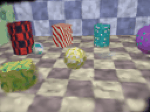
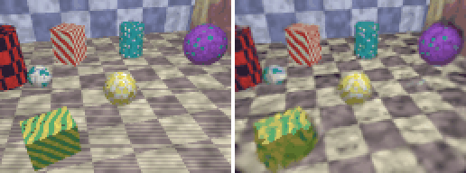
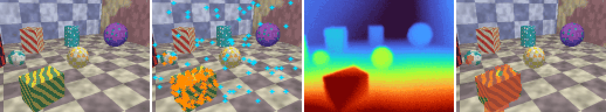
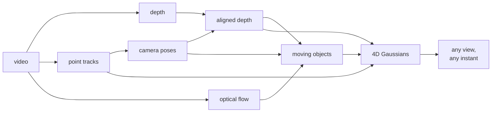
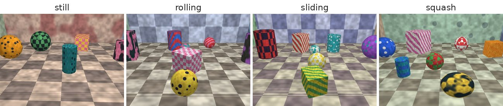
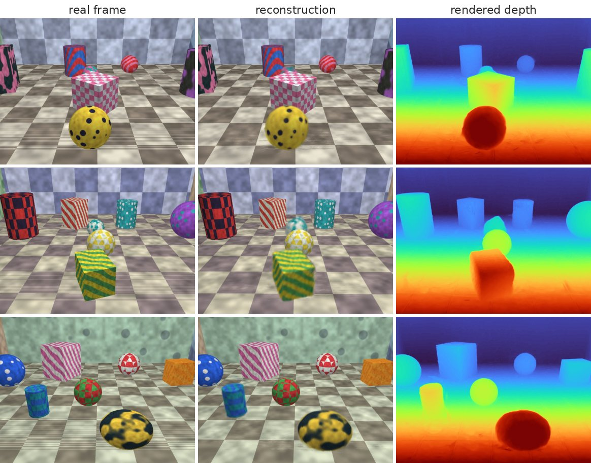
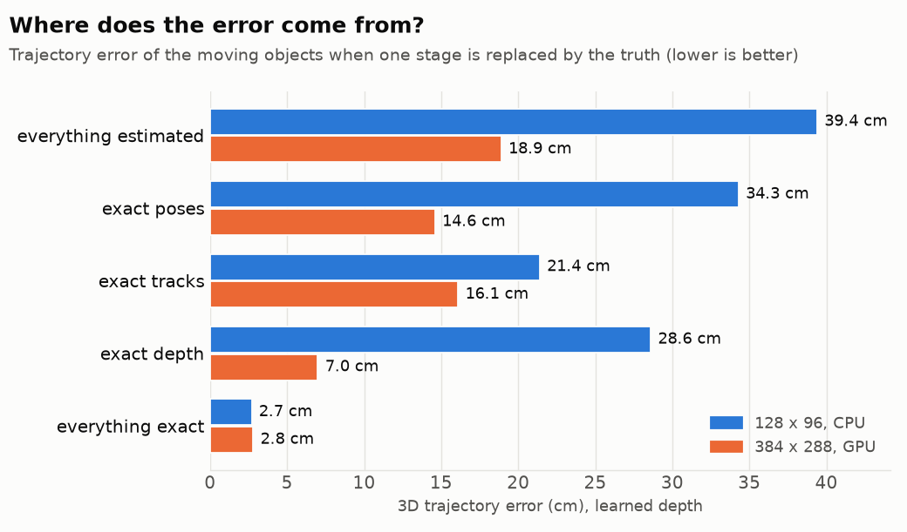
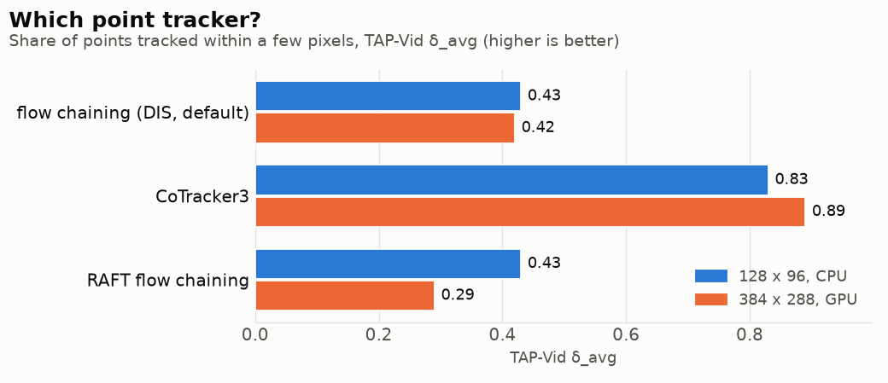
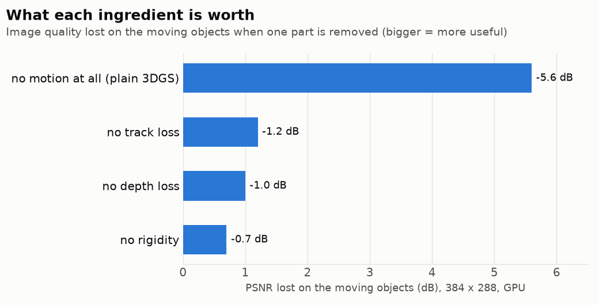

# recon4d

**Turn an ordinary video into a 3D scene that moves.** recon4d watches a video filmed with
a single camera, works out the depth, the camera's path and how every point moves, and
builds a 4D scene (3D + time) that can be seen from any viewpoint at any instant.

[](https://github.com/francoisbarge8/recon4d/actions/workflows/ci.yml)


<p align="center">
  
  
</p>
<p align="center"><sub><b>Left:</b> the reconstruction filmed by a virtual camera that never existed.
<b>Right:</b> a camera hidden from the method (real view | predicted view).</sub></p>

Everything is written from scratch in PyTorch and runs on a laptop CPU as well as on a
GPU: the Gaussian-splatting renderer, structure-from-motion with bundle adjustment, depth
alignment, motion segmentation and the 4D optimisation. The project ships its own
benchmark, with exact ground truth for every quantity it estimates.

## How it works

<p align="center">
  
</p>
<p align="center"><sub>video frame · point tracks (orange: moving) · depth (warm = near) · moving objects</sub></p>

1. **Read the video.** For every frame, predict a depth map, follow points from frame to
   frame, and measure the optical flow.
2. **Find the camera.** Structure-from-motion on the tracked points, refined by bundle
   adjustment, gives the camera position at every frame.
3. **Separate what moves.** Pixels whose motion the camera alone cannot explain belong to
   moving objects.
4. **Build the 4D scene.** The static world becomes thousands of small coloured 3D blobs
   (Gaussians); the moving objects get Gaussians driven by a few rigid motions. Everything
   is optimised so that the rendered video matches the real one.



Each stage has several back-ends (Depth Anything V2 or a small in-domain U-Net for depth;
KLT, flow chaining or CoTracker3 for tracking; DIS or RAFT for flow; built-in SfM or
COLMAP for poses) and can be replaced by its ground truth, which is how the benchmark
finds where the error comes from. Details: [docs/DESIGN.md](docs/DESIGN.md).

## Results

Four synthetic scenes with exact ground truth: a static room, two rolling balls, a
spinning crate sliding past a bouncing ball, and a soft blob that squashes and stretches.

<p align="center"></p>

At full size (60 frames at 384 x 288, two Kaggle T4 GPUs, depth from the in-domain
network), on cameras the method never saw:

<p align="center"></p>

| | small format (128 x 96, CPU) | full size (384 x 288, GPU) |
|---|---:|---:|
| image quality on unseen cameras (PSNR, higher is better) | 22.1 dB | **25.0 dB** |
| geometry error (Chamfer) | 8.1 cm | **3.2 cm** |
| camera path error (ATE) | 0.59 cm | **0.11 cm** |
| motion error of the moving objects (3D EPE) | 39.4 cm | **18.9 cm** |

<picture>
  <source media="(prefers-color-scheme: dark)" srcset="docs/media/chart_oracle_dark.png">
  
</picture>

**What limits the result depends on the size.** In the small format the point tracks are
the weak link (exact tracks: 39 to 21 cm). At full size the tracks are good enough and the
depth of the moving objects becomes the bottleneck (exact depth: 19 to 7 cm).

<picture>
  <source media="(prefers-color-scheme: dark)" srcset="docs/media/chart_trackers_dark.png">
  
</picture>

**CoTracker3 tracks twice as well** as the default flow chaining, but costs minutes per
video instead of seconds, and at full size it only takes the motion error from 18.9 to
15.5 cm. RAFT does worse than the classical DIS flow here.

<picture>
  <source media="(prefers-color-scheme: dark)" srcset="docs/media/chart_ablations_dark.png">
  
</picture>

**Modelling motion is essential:** a plain static 3D Gaussian splatting loses 5.6 dB on
the moving objects. The point-track loss is the next most useful ingredient.

A few more findings:

* The pure-PyTorch renderer matches gsplat's CUDA renderer to 83 dB (it is about 30 times
  slower).
* A depth network can beat a simulated noisy depth on the static pixels (2.0% against
  3.5% error) and still lose on the moving objects (5.1% against 3.7%).
* The monocular depth prior in bundle adjustment helps in the small format and hurts at
  full size, so it stays off by default.

Every table (oracles, ablations, back-ends, 3 seeds on CPU): **[docs/RESULTS.md](docs/RESULTS.md)**.
The protocol: [docs/BENCHMARK.md](docs/BENCHMARK.md).

## Installation

```bash
git clone https://github.com/francoisbarge8/recon4d.git
cd recon4d
pip install -e .
```

Python 3.10+ and PyTorch 2.1+. Optional extras:

| extra | adds |
|---|---|
| `.[dev]` | pytest, ruff |
| `.[lpips]` | the LPIPS metric |
| `.[depth]` | Depth Anything V2 (through `transformers`) |
| `.[colmap]` | COLMAP poses (through `pycolmap`) |

## Quick start

```bash
# Render a benchmark scene and look at it (video | depth | moving objects)
recon4d synth rolling --out outputs/preview

# Reconstruct it and evaluate against the ground truth
recon4d run rolling --out outputs/rolling --frames 24 --width 128 --height 96 \
    train.iterations=800 "train.crop=[96,72]"

# Reconstruct your own video (Depth Anything V2 + RAFT, unknown focal length)
pip install -e ".[depth]"
recon4d video clip.mp4 --out outputs/clip device=cuda

# The benchmark: scenes x pipeline variants, with result tables
recon4d benchmark --profile cpu --out results/cpu
```

Any option of the pipeline can be overridden on the command line as `key=value`
(`recon4d config default.yaml` writes them all to a file). A run writes its metrics, the
optimised scene (`.pt` and 3DGS-compatible `.ply`), a fused point cloud and videos:
reconstruction against input, the scene from an orbiting camera with time frozen and with
time running, and the held-out cameras.

From Python:

```python
from recon4d.benchmark import PROFILES
from recon4d.config import apply_overrides
from recon4d.data.synthetic import SyntheticConfig, build_synthetic_sequence
from recon4d.evaluation import evaluate_scene
from recon4d.gaussians.render import Camera
from recon4d.pipeline import PipelineConfig, run_pipeline

seq = build_synthetic_sequence(SyntheticConfig(scene="sliding", n_frames=24, width=128, height=96))
cfg = apply_overrides(PipelineConfig(), PROFILES["cpu"].overrides)  # a CPU-sized budget
result = run_pipeline(seq, cfg)

front = result.frontend            # poses, aligned depth, tracks, motion masks
camera = Camera(front.K, front.w2c[0], seq.width, seq.height)
view = result.scene.render(camera, frame=12)   # the scene at time 12 seen from camera 0
print(view.color.shape, view.depth.shape)

metrics = evaluate_scene(seq, front, result.scene)
print(metrics["nvs_val"]["psnr"], metrics["tracking_3d"]["epe_3d"])
```

## Full-size runs on a GPU

The CPU profile is deliberately small. [notebooks/kaggle_benchmark.ipynb](notebooks/kaggle_benchmark.ipynb)
runs the full-size benchmark (60 frames at 384 x 288, 7000 optimisation steps) on a free
Kaggle notebook with two T4 GPUs: it installs the package, runs the tests, trains the
in-domain depth network, runs every variant with one worker per GPU and zips the results.

```bash
python scripts/train_depth.py --out assets/checkpoints/tiny_depth.pth
python scripts/run_benchmark_multi_gpu.py --out results/gpu --profile gpu --lpips alex \
    depth=learned depth_checkpoint=assets/checkpoints/tiny_depth.pth
```

<details>
<summary><b>What is implemented, in detail</b></summary>

* **A differentiable 3D Gaussian splatting rasterizer in pure PyTorch**
  ([rasterizer.py](src/recon4d/gaussians/rasterizer.py)): EWA projection, tile binning,
  front-to-back compositing, exact opacity-aware bounding boxes. Verified against a
  brute-force reference to 1e-10 and by `gradcheck`.
* **A 4D scene model** in the spirit of Shape of Motion: dynamic Gaussians follow a convex
  blend of a few rigid motion bases; 2D tracks supervise motion through rendered 3D
  correspondences; as-rigid-as-possible and smoothness regularisers; adaptive density
  control.
* **Structure-from-motion on point tracks** with a **Levenberg-Marquardt bundle
  adjustment** written in PyTorch (Schur complement, analytic Jacobians checked against
  autograd, Huber loss, optional shared focal length, optional monocular depth prior with
  per-camera scale and shift).
* **Depth alignment** of per-frame monocular depth to the sparse SfM structure (robust
  global fit plus a smooth correction field).
* **Training-free motion segmentation** from the disagreement between observed and rigid
  optical flow.
* **A procedural 4D benchmark with exact ground truth** ([docs/BENCHMARK.md](docs/BENCHMARK.md)):
  ray-traced scenes with moving objects, an oracle answering arbitrary queries (tracks,
  flow, scene flow, surface samples), held-out cameras at the training instants with
  co-visibility masks.
* **Metrics**: PSNR, SSIM, LPIPS; Chamfer distance, accuracy / completeness, F-score;
  ATE, RPE, orientation error; AbsRel / RMSE / delta depth metrics; TAP-Vid tracking
  metrics; 3D trajectory error; temporal consistency (depth temporal error, warping
  error, temporal-difference PSNR).
* **COLMAP interoperability**: export of the front-end as a COLMAP dataset (opens in
  COLMAP's GUI, feeds other 3DGS / NeRF trainers), and COLMAP as an alternative pose
  back-end.

* **TSDF fusion** of posed depth maps with surface extraction as points or as a triangle
  mesh (naive surface nets), in PyTorch ([tsdf.py](src/recon4d/fusion/tsdf.py)).

</details>

<details>
<summary><b>Repository layout</b></summary>

```
src/recon4d/
  data/synthetic/   procedural scenes, ray tracer, ground-truth oracle
  frontend/         depth, optical flow, point tracking, SfM + bundle adjustment, motion segmentation
  fusion/           depth alignment, point-cloud fusion
  gaussians/        rasterizer, scene model, motion bases, initialisation, trainer
  geometry/         cameras, rotations, alignment, triangulation
  metrics/          image, geometry, pose, depth, tracking and temporal metrics
  io/               COLMAP models
  pipeline.py       the end-to-end pipeline
  evaluation.py     evaluation against ground truth
  benchmark.py      scenes x variants, result tables
  cli.py            command-line interface
scripts/            depth-network training, multi-GPU benchmark, gsplat cross-check
notebooks/          Kaggle notebook for the full-size benchmark
tests/              unit and integration tests
docs/               design notes, benchmark protocol
```

</details>

## Tests

```bash
pip install -e ".[dev]"
pytest
ruff check src tests scripts
```

The suite covers the geometry, the ray tracer and its oracle, the rasterizer (against a
brute-force reference, `gradcheck`, tile-size invariance), every metric, bundle adjustment
(Jacobians against autograd, convergence, robustness), SfM, trackers, depth alignment,
motion bases, the scene model and the end-to-end pipeline on tiny sequences.

## Limitations

The CPU renderer is far slower than a CUDA kernel, so local runs are small; the motion
model suits rigid and articulated motion, not fluids; motion segmentation needs the camera
to move; the benchmark is synthetic (real videos run, without quantitative evaluation).
In full: [docs/DESIGN.md](docs/DESIGN.md#limitations).

<details>
<summary><b>References</b></summary>

* Kerbl et al., *3D Gaussian Splatting for Real-Time Radiance Field Rendering*, SIGGRAPH 2023.
* Zwicker et al., *EWA Splatting*, IEEE TVCG 2002.
* Wang et al., *Shape of Motion: 4D Reconstruction from a Single Video*, 2024.
* Luiten et al., *Dynamic 3D Gaussians: Tracking by Persistent Dynamic View Synthesis*, 3DV 2024.
* Schönberger and Frahm, *Structure-from-Motion Revisited* (COLMAP), CVPR 2016.
* Triggs et al., *Bundle Adjustment: A Modern Synthesis*, 1999.
* Yang et al., *Depth Anything V2*, NeurIPS 2024.
* Karaev et al., *CoTracker3: Simpler and Better Point Tracking by Pseudo-Labelling Real Videos*, 2024.
* Teed and Deng, *RAFT: Recurrent All-Pairs Field Transforms for Optical Flow*, ECCV 2020.
* Doersch et al., *TAP-Vid: A Benchmark for Tracking Any Point in a Video*, NeurIPS 2022.
* Gao et al., *Monocular Dynamic View Synthesis: A Reality Check* (DyCheck), NeurIPS 2022.
* Zhang et al., *The Unreasonable Effectiveness of Deep Features as a Perceptual Metric* (LPIPS), CVPR 2018.
* Knapitsch et al., *Tanks and Temples: Benchmarking Large-Scale Scene Reconstruction*, SIGGRAPH 2017 (F-score protocol).

</details>

## License

MIT, see [LICENSE](LICENSE).
