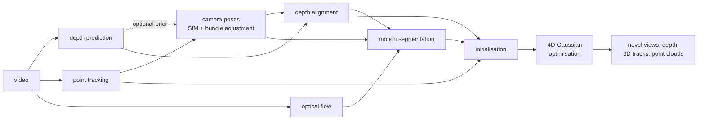
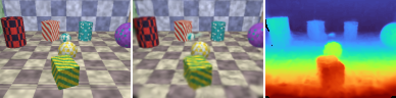

# recon4d

**3D/4D reconstruction from monocular video**: depth prediction, camera pose estimation
and point tracking, fused into a scene of static and moving 3D Gaussians that can be
rendered from any viewpoint at any instant of the video.

[](https://github.com/francoisbarge8/recon4d/actions/workflows/ci.yml)


Everything is PyTorch, written from scratch, and runs on a laptop CPU as well as on a GPU:
the differentiable Gaussian-splatting rasterizer, bundle adjustment, structure-from-motion
on point tracks, depth alignment, motion segmentation, and the 4D scene optimisation. The
project also ships its own benchmark, with exact ground truth for every quantity the
pipeline estimates.

## Pipeline



| stage | what it does | back-ends |
|---|---|---|
| depth | one depth map per frame, up to scale | Depth Anything V2, in-domain U-Net, oracle (+ noise model) |
| tracking | 2D point tracks through the video | KLT, flow chaining, CoTracker3, oracle |
| optical flow | dense motion between frames | DIS, RAFT, oracle |
| camera poses | incremental SfM on the tracks, bundle adjustment | built-in, COLMAP (pycolmap), ground truth |
| depth alignment | makes the depth maps consistent with the poses and with each other | scale / affine + smooth correction field |
| motion segmentation | which pixels and tracks move on their own | rigid-flow residuals |
| scene | static 3D Gaussians + dynamic Gaussians driven by a few SE(3) motion bases | pure-PyTorch rasterizer |

Each stage can be replaced by its ground truth (`oracle`), which is how the benchmark
attributes the final error to depth, tracking or pose estimation. [docs/DESIGN.md](docs/DESIGN.md)
explains every stage and the reasons behind the design.

## What is implemented

* **A differentiable 3D Gaussian splatting rasterizer in pure PyTorch**
  ([rasterizer.py](src/recon4d/gaussians/rasterizer.py)): EWA projection, tile binning,
  front-to-back compositing, exact opacity-aware bounding boxes. Verified against a
  brute-force reference to 1e-10 and by `gradcheck`.
* **A 4D scene model** in the spirit of Shape of Motion: dynamic Gaussians follow a convex
  blend of a few rigid motion bases; 2D tracks supervise motion through rendered 3D
  correspondences; as-rigid-as-possible and smoothness regularisers; adaptive density
  control.
* **Structure-from-motion on point tracks** with a **Levenberg-Marquardt bundle
  adjustment** written in PyTorch (Schur complement, analytic Jacobians checked against
  autograd, Huber loss, optional shared focal length, optional monocular depth prior with
  per-camera scale and shift).
* **Depth alignment** of per-frame monocular depth to the sparse SfM structure (robust
  global fit plus a smooth correction field).
* **Training-free motion segmentation** from the disagreement between observed and rigid
  optical flow.
* **A procedural 4D benchmark with exact ground truth** ([docs/BENCHMARK.md](docs/BENCHMARK.md)):
  ray-traced scenes with moving objects, an oracle answering arbitrary queries (tracks,
  flow, scene flow, surface samples), held-out cameras at the training instants with
  co-visibility masks.
* **Metrics**: PSNR, SSIM, LPIPS; Chamfer distance, accuracy / completeness, F-score;
  ATE, RPE, orientation error; AbsRel / RMSE / delta depth metrics; TAP-Vid tracking
  metrics; 3D trajectory error; temporal consistency (depth temporal error, warping
  error, temporal-difference PSNR).
* **COLMAP interoperability**: export of the front-end as a COLMAP dataset (opens in
  COLMAP's GUI, feeds other 3DGS / NeRF trainers), and COLMAP as an alternative pose
  back-end.

* **TSDF fusion** of posed depth maps with surface extraction as points or as a triangle
  mesh (naive surface nets), in PyTorch ([tsdf.py](src/recon4d/fusion/tsdf.py)).

## Results

The complete benchmark at the `cpu` profile: 4 scenes x 15 variants x 3 seeds, run on a
4-core CPU without a GPU, plus the same benchmark with the depth predicted by a network
(below), 348 reconstructions in all, each of 24 frames at 128 x 96 with 800 optimisation
steps. A seed changes the layout, the textures and the camera shake of every scene; each
number is the **mean ± standard deviation over the 3 seeds**. LPIPS uses AlexNet. Depth
comes from the noisy oracle (the default of this profile, see
[docs/BENCHMARK.md](docs/BENCHMARK.md)) unless stated otherwise. Every metric of every
variant: [results/cpu/results.md](results/cpu/results.md); the metrics of each run:
`results/cpu/seed*/results.json`; the commands:
[docs/BENCHMARK.md](docs/BENCHMARK.md#several-seeds).



*`sliding`, default pipeline, seed 0: input frame, reconstruction, rendered depth
([video](results/cpu/figures/sliding_full_reconstruction.gif),
[orbiting camera, time frozen](results/cpu/figures/sliding_full_bullet_time.gif)).*

**Default pipeline** (KLT + flow chaining with DIS, SfM + bundle adjustment, depth
alignment, motion segmentation, 4D Gaussians), per scene:

|  | ATE (cm) | aligned depth AbsRel (%) | PSNR held-out frames | PSNR held-out cameras | LPIPS held-out cameras | PSNR moving objects | Chamfer (cm) | 3D EPE (cm) | mask IoU |
|---|---:|---:|---:|---:|---:|---:|---:|---:|---:|
| still | 0.52 ± 0.04 | 2.6 ± 1.4 | 26.65 ± 0.74 | 23.43 ± 1.01 | 0.093 ± 0.006 | - | 7.6 ± 3.6 | - | - |
| rolling | 0.47 ± 0.04 | 2.4 ± 0.9 | 25.02 ± 0.41 | 22.36 ± 0.79 | 0.119 ± 0.009 | 17.47 ± 1.15 | 6.6 ± 2.2 | 36.2 ± 14.5 | 0.726 ± 0.019 |
| sliding | 0.60 ± 0.11 | 3.3 ± 1.5 | 25.18 ± 0.50 | 21.73 ± 1.58 | 0.121 ± 0.005 | 17.94 ± 0.29 | 8.6 ± 3.3 | 41.6 ± 14.3 | 0.769 ± 0.013 |
| squash | 0.78 ± 0.21 | 2.8 ± 0.8 | 26.16 ± 0.35 | 22.25 ± 0.91 | 0.112 ± 0.014 | 17.98 ± 0.74 | 9.1 ± 1.4 | 17.8 ± 5.9 | 0.725 ± 0.010 |

PSNR and LPIPS on held-out cameras are computed on the pixels the video observes; "moving
objects" restricts them to those objects. 3D EPE: true surface points handed to the
scene's motion field and compared with their true trajectory over the whole video.

**Where the error comes from.** One stage at a time is replaced by its ground truth,
averaged over the four scenes:

|  | PSNR held-out cameras | LPIPS held-out cameras | PSNR moving objects | Chamfer (cm) | Chamfer moving (cm) | 3D EPE (cm) | track δ_avg |
|---|---:|---:|---:|---:|---:|---:|---:|
| `full` | 22.44 ± 0.25 | 0.111 ± 0.006 | 17.80 ± 0.63 | 8.0 ± 0.6 | 12.1 ± 2.3 | 31.9 ± 7.3 | 0.429 ± 0.016 |
| `oracle-depth` | 22.50 ± 0.18 | 0.110 ± 0.004 | 17.85 ± 0.72 | 7.8 ± 0.9 | 12.2 ± 1.7 | 28.6 ± 1.4 | 0.430 ± 0.016 |
| `oracle-poses` | 23.75 ± 0.14 | 0.099 ± 0.004 | 18.15 ± 0.62 | 5.2 ± 0.1 | 10.4 ± 1.7 | 28.0 ± 7.3 | 0.430 ± 0.016 |
| `oracle-tracks` | 24.16 ± 0.12 | 0.091 ± 0.000 | 19.32 ± 0.41 | 4.4 ± 0.0 | 4.0 ± 0.3 | 6.7 ± 1.0 | 1.000 ± 0.000 |
| `oracle-all` | 24.57 ± 0.11 | 0.079 ± 0.003 | 21.03 ± 0.15 | 3.4 ± 0.0 | 2.8 ± 0.3 | 2.7 ± 0.8 | 1.000 ± 0.000 |
| `static-only` | 20.27 ± 0.25 | 0.175 ± 0.013 | 11.22 ± 0.54 | 8.3 ± 0.6 | - | 74.2 ± 0.2 | 0.483 ± 0.009 |

* **Point tracking is the bottleneck.** Exact tracks and flow (which also make the SfM
  poses exact) bring the 3D trajectory error from 32 cm to 7 cm and the moving surfaces
  from 12.1 cm to 4.0 cm. The dense tracker chains optical flow and drops points at
  occlusions (TAP-Vid δ_avg 0.43).
* Exact poses mostly help the static geometry (Chamfer 8.0 to 5.2 cm, +1.3 dB on the
  held-out cameras), although the estimated trajectory is already within 0.6 cm.
* Exact depth changes little (less than 0.1 dB): once aligned to the poses, the noisy
  depth is already within 2.8% of the truth.
* With every input exact, the moving objects (21.0 dB) remain 3.5 dB below the whole image:
  that gap belongs to the scene optimisation at this budget.
* Ignoring the motion (`static-only`, plain 3DGS) costs 2.2 dB on the held-out cameras and
  6.6 dB on the moving objects.

**Ablations**, averaged over the four scenes:

|  | aligned depth AbsRel (%) | PSNR held-out cameras | LPIPS held-out cameras | PSNR moving objects | Chamfer (cm) | 3D EPE (cm) |
|---|---:|---:|---:|---:|---:|---:|
| `full` | 2.8 ± 0.5 | 22.44 ± 0.25 | 0.111 ± 0.006 | 17.80 ± 0.63 | 8.0 ± 0.6 | 31.9 ± 7.3 |
| `no-depth-loss` | 2.8 ± 0.5 | 22.38 ± 0.24 | 0.115 ± 0.004 | 17.60 ± 0.74 | 8.2 ± 0.4 | 32.3 ± 7.0 |
| `no-track-loss` | 2.8 ± 0.5 | 22.25 ± 0.09 | 0.112 ± 0.004 | 16.36 ± 0.47 | 7.6 ± 0.5 | 31.3 ± 6.0 |
| `no-rigidity` | 2.8 ± 0.5 | 22.43 ± 0.24 | 0.115 ± 0.006 | 17.96 ± 0.57 | 8.0 ± 0.6 | 33.9 ± 5.4 |
| `no-depth-correction` | 4.1 ± 0.5 | 22.00 ± 0.17 | 0.118 ± 0.003 | 16.86 ± 0.68 | 7.7 ± 0.3 | 35.9 ± 10.6 |
| `depth-prior-ba` | 2.6 ± 1.4 | 22.37 ± 1.56 | 0.113 ± 0.009 | 17.28 ± 1.13 | 10.1 ± 5.3 | 34.7 ± 5.7 |

* The track loss is what animates the moving objects: without it they lose 1.4 dB.
* The depth correction field brings the aligned depth from 4.1% to 2.8% AbsRel (+0.4 dB on
  the held-out cameras).
* The depth loss and the rigidity regulariser make no difference larger than the spread
  over the seeds at this budget.
* The monocular depth prior in bundle adjustment does not help on average and makes the
  geometry unpredictable (Chamfer 10.1 ± 5.3 cm against 8.0 ± 0.6 cm), which is why it is
  off by default (but see the learned depth below).

**Back-ends**: one stage of the default pipeline replaced by a pretrained model or by
COLMAP, averaged over the four scenes:

|  | raw depth AbsRel (%) | ATE (cm) | RPE-r (deg) | track δ_avg | PSNR held-out cameras | PSNR moving objects | Chamfer (cm) | 3D EPE (cm) |
|---|---:|---:|---:|---:|---:|---:|---:|---:|
| `full` | 3.5 ± 0.3 | 0.59 ± 0.07 | 0.077 ± 0.003 | 0.429 ± 0.016 | 22.44 ± 0.25 | 17.80 ± 0.63 | 8.0 ± 0.6 | 31.9 ± 7.3 |
| `depth-anything` | 2.3 ± 0.1 | 0.59 ± 0.07 | 0.077 ± 0.003 | 0.431 ± 0.016 | 21.81 ± 0.24 | 16.40 ± 0.65 | 8.1 ± 0.7 | 35.0 ± 5.8 |
| `raft` | 3.5 ± 0.3 | 0.59 ± 0.07 | 0.077 ± 0.003 | 0.431 ± 0.016 | 22.10 ± 0.44 | 16.86 ± 0.48 | 8.0 ± 0.7 | 45.9 ± 10.2 |
| `cotracker` | 3.5 ± 0.3 | 0.59 ± 0.07 | 0.077 ± 0.003 | 0.832 ± 0.010 | 22.53 ± 0.17 | 18.46 ± 0.23 | 7.9 ± 0.8 | 11.0 ± 1.8 |
| `colmap` | 3.5 ± 0.3 | 2.03 ± 0.78 | 0.217 ± 0.027 | 0.423 ± 0.013 | 21.23 ± 1.37 | 16.50 ± 1.42 | 14.8 ± 8.3 | 37.1 ± 8.4 |

* **CoTracker3 removes most of the tracking error**: TAP-Vid δ_avg 0.83 against 0.43, 3D
  trajectory error 11 cm against 32 cm, +0.7 dB on the moving objects. On this CPU it
  costs about 10 minutes of tracking per run against a few seconds for flow chaining,
  which is why it is not the default here.
* RAFT (small) does worse than DIS at this resolution: 3D trajectory error 46 cm against
  32 cm, -0.9 dB on the moving objects. The `gpu` profile (384 x 288) is the fairer test.
* COLMAP is close to the track-based SfM on the static scene (ATE 0.76 against 0.52 cm);
  the gap grows with the moving objects, which COLMAP is not told about (4.4 against
  0.8 cm on `squash`).

**Depth predicted from pixels.** The default depth is a noise model of a monocular
network. Two real networks instead: Depth Anything V2 (zero-shot) as a variant of the
benchmark above, and the in-domain U-Net (`depth=learned`, the setting of the Kaggle
notebook) as the depth back-end of a second complete run, trained here on CPU for 12 epochs
instead of 40 (2400 frames of random scenes, 1.8% AbsRel on its validation scenes). Every
table of that run: [results/cpu-learned/results.md](results/cpu-learned/results.md).

| depth back-end | raw depth AbsRel (%) | aligned depth AbsRel (%) | PSNR held-out cameras | LPIPS held-out cameras | PSNR moving objects | Chamfer (cm) | 3D EPE (cm) |
|---|---:|---:|---:|---:|---:|---:|---:|
| noisy oracle (default of the profile) | 3.5 ± 0.3 | 2.8 ± 0.5 | 22.44 ± 0.25 | 0.111 ± 0.006 | 17.80 ± 0.63 | 8.0 ± 0.6 | 31.9 ± 7.3 |
| Depth Anything V2 (small) | 2.3 ± 0.1 | 3.0 ± 0.5 | 21.81 ± 0.24 | 0.121 ± 0.002 | 16.40 ± 0.65 | 8.1 ± 0.7 | 35.0 ± 5.8 |
| in-domain U-Net | 2.1 ± 0.2 | 2.8 ± 0.4 | 22.08 ± 0.13 | 0.117 ± 0.003 | 16.57 ± 0.13 | 8.1 ± 0.6 | 39.4 ± 6.7 |
| in-domain U-Net, depth prior in BA | 2.1 ± 0.2 | 2.1 ± 0.2 | 22.54 ± 0.27 | 0.113 ± 0.002 | 16.75 ± 0.02 | 6.3 ± 0.3 | 36.6 ± 4.6 |

* Both networks beat the noise model on raw depth (2.3% and 2.1% against 3.5%) and lose
  end to end, mostly on the moving objects (-1.4 and -1.2 dB). For the U-Net the error
  sits there: 2.0% against 3.5% AbsRel on the static pixels of the three dynamic scenes,
  5.1% against 3.7% on the moving objects.
* With the U-Net, the depth prior in bundle adjustment **helps**: Chamfer 8.1 to 6.3 cm,
  +0.5 dB on the held-out cameras, aligned depth 2.8% to 2.1%, with a small spread. With
  the noise model it made the geometry unpredictable (above). It stays off by default, the
  default depth of the profile being the noise model; with a network, turn it on with
  `sfm.depth_weight=10`.
* The U-Net has to run at the size it was trained at (192 x 144): applied to the 128 x 96
  frames directly, its error on a benchmark scene went from 1.5% to 4.3% (and to 5.5% on
  the 384 x 288 frames of the `gpu` profile). The `learned` back-end now resizes the
  frames.

**Not run yet.** The full-size `gpu` profile (60 frames at 384 x 288, 7000 steps) needs a
GPU: it is what [the Kaggle notebook](notebooks/kaggle_benchmark.ipynb) runs, as does the
cross-check against gsplat (CUDA only). CoTracker3 was not combined with the learned depth
on CPU (12 more runs of about 10 minutes each).

## Installation

```bash
git clone https://github.com/francoisbarge8/recon4d.git
cd recon4d
pip install -e .
```

Python 3.10+ and PyTorch 2.1+. Optional extras:

| extra | adds |
|---|---|
| `.[dev]` | pytest, ruff |
| `.[lpips]` | the LPIPS metric |
| `.[depth]` | Depth Anything V2 (through `transformers`) |
| `.[colmap]` | COLMAP poses (through `pycolmap`) |

## Quick start

```bash
# Render a benchmark scene and look at it (video | depth | moving objects)
recon4d synth rolling --out outputs/preview

# Reconstruct it and evaluate against the ground truth
recon4d run rolling --out outputs/rolling --frames 24 --width 128 --height 96 \
    train.iterations=800 "train.crop=[96,72]"

# Reconstruct your own video (Depth Anything V2 + RAFT, unknown focal length)
pip install -e ".[depth]"
recon4d video clip.mp4 --out outputs/clip device=cuda

# The benchmark: scenes x pipeline variants, with result tables
recon4d benchmark --profile cpu --out results/cpu
```

Any option of the pipeline can be overridden on the command line as `key=value`
(`recon4d config default.yaml` writes them all to a file). A run writes its metrics, the
optimised scene (`.pt` and 3DGS-compatible `.ply`), a fused point cloud and videos:
reconstruction against input, the scene from an orbiting camera with time frozen and with
time running, and the held-out cameras.

From Python:

```python
from recon4d.benchmark import PROFILES
from recon4d.config import apply_overrides
from recon4d.data.synthetic import SyntheticConfig, build_synthetic_sequence
from recon4d.evaluation import evaluate_scene
from recon4d.gaussians.render import Camera
from recon4d.pipeline import PipelineConfig, run_pipeline

seq = build_synthetic_sequence(SyntheticConfig(scene="sliding", n_frames=24, width=128, height=96))
cfg = apply_overrides(PipelineConfig(), PROFILES["cpu"].overrides)  # a CPU-sized budget
result = run_pipeline(seq, cfg)

front = result.frontend            # poses, aligned depth, tracks, motion masks
camera = Camera(front.K, front.w2c[0], seq.width, seq.height)
view = result.scene.render(camera, frame=12)   # the scene at time 12 seen from camera 0
print(view.color.shape, view.depth.shape)

metrics = evaluate_scene(seq, front, result.scene)
print(metrics["nvs_val"]["psnr"], metrics["tracking_3d"]["epe_3d"])
```

## Full-size runs on a GPU

The CPU profile is deliberately small. [notebooks/kaggle_benchmark.ipynb](notebooks/kaggle_benchmark.ipynb)
runs the full-size benchmark (60 frames at 384 x 288, 7000 optimisation steps) on a free
Kaggle notebook with two T4 GPUs: it installs the package, runs the tests, trains the
in-domain depth network, runs every variant with one worker per GPU and zips the results.

```bash
python scripts/train_depth.py --out assets/checkpoints/tiny_depth.pth
python scripts/run_benchmark_multi_gpu.py --out results/gpu --profile gpu --lpips alex \
    depth=learned depth_checkpoint=assets/checkpoints/tiny_depth.pth
```

## Repository layout

```
src/recon4d/
  data/synthetic/   procedural scenes, ray tracer, ground-truth oracle
  frontend/         depth, optical flow, point tracking, SfM + bundle adjustment, motion segmentation
  fusion/           depth alignment, point-cloud fusion
  gaussians/        rasterizer, scene model, motion bases, initialisation, trainer
  geometry/         cameras, rotations, alignment, triangulation
  metrics/          image, geometry, pose, depth, tracking and temporal metrics
  io/               COLMAP models
  pipeline.py       the end-to-end pipeline
  evaluation.py     evaluation against ground truth
  benchmark.py      scenes x variants, result tables
  cli.py            command-line interface
scripts/            depth-network training, multi-GPU benchmark, gsplat cross-check
notebooks/          Kaggle notebook for the full-size benchmark
tests/              unit and integration tests
docs/               design notes, benchmark protocol
```

## Tests

```bash
pip install -e ".[dev]"
pytest
ruff check src tests scripts
```

The suite covers the geometry, the ray tracer and its oracle, the rasterizer (against a
brute-force reference, `gradcheck`, tile-size invariance), every metric, bundle adjustment
(Jacobians against autograd, convergence, robustness), SfM, trackers, depth alignment,
motion bases, the scene model and the end-to-end pipeline on tiny sequences.

## Limitations

Stated in full in [docs/DESIGN.md](docs/DESIGN.md#limitations). In short: the CPU
rasterizer is orders of magnitude slower than a CUDA kernel, so local runs are small; the
motion model suits rigid and articulated motion, not fluids or topology changes; motion
segmentation needs parallax; the benchmark is synthetic (real videos run, but without
quantitative evaluation).

## References

* Kerbl et al., *3D Gaussian Splatting for Real-Time Radiance Field Rendering*, SIGGRAPH 2023.
* Zwicker et al., *EWA Splatting*, IEEE TVCG 2002.
* Wang et al., *Shape of Motion: 4D Reconstruction from a Single Video*, 2024.
* Luiten et al., *Dynamic 3D Gaussians: Tracking by Persistent Dynamic View Synthesis*, 3DV 2024.
* Schönberger and Frahm, *Structure-from-Motion Revisited* (COLMAP), CVPR 2016.
* Triggs et al., *Bundle Adjustment: A Modern Synthesis*, 1999.
* Yang et al., *Depth Anything V2*, NeurIPS 2024.
* Karaev et al., *CoTracker3: Simpler and Better Point Tracking by Pseudo-Labelling Real Videos*, 2024.
* Teed and Deng, *RAFT: Recurrent All-Pairs Field Transforms for Optical Flow*, ECCV 2020.
* Doersch et al., *TAP-Vid: A Benchmark for Tracking Any Point in a Video*, NeurIPS 2022.
* Gao et al., *Monocular Dynamic View Synthesis: A Reality Check* (DyCheck), NeurIPS 2022.
* Zhang et al., *The Unreasonable Effectiveness of Deep Features as a Perceptual Metric* (LPIPS), CVPR 2018.
* Knapitsch et al., *Tanks and Temples: Benchmarking Large-Scale Scene Reconstruction*, SIGGRAPH 2017 (F-score protocol).

## License

MIT, see [LICENSE](LICENSE).
