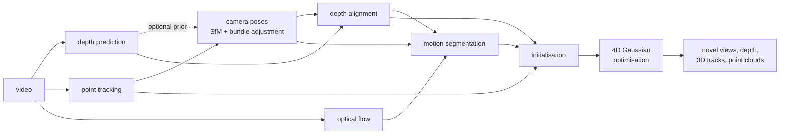

# Design notes

This document explains how the pipeline works and why it is built the way it is. The
[benchmark protocol](BENCHMARK.md) describes how it is evaluated.

## Overview

The input is a monocular video; the output is a set of 3D Gaussians, some static and some
moving, that can be rendered from any viewpoint at any time of the video.

Every box is a back-end selected by name in `PipelineConfig`, and every box has an
`oracle` back-end that returns the ground truth of the synthetic benchmark. Replacing one
stage at a time by its oracle is how the benchmark attributes the final error to depth,
tracking or pose estimation.

| stage | back-ends |
|---|---|
| depth | `oracle`, `oracle-noisy`, `learned` (in-domain U-Net), `depth-anything` (Depth Anything V2) |
| tracking | `klt`, `flow-chain`, `cotracker` (CoTracker3), `oracle` |
| optical flow | `dis`, `raft`, `raft-large`, `oracle` |
| camera poses | `sfm`, `gt` |

## Conventions

* Camera frame: OpenCV / COLMAP (`+x` right, `+y` down, `+z` forward). Poses are
  world-to-camera 4 x 4 matrices (`w2c`).
* Pixel `(i, j)` covers `[j, j+1] x [i, i+1]`: its centre is at `(j + 0.5, i + 0.5)`.
  This is `grid_sample(align_corners=False)`; coordinates are shifted by half a pixel at
  the OpenCV boundary.
* Depth is z-depth (not distance along the ray). Quaternions are `(w, x, y, z)`.
* Images are `(H, W, 3)` floats in `[0, 1]`; a video is `(T, H, W, 3)`.

## Front-end

### Depth prediction

A monocular network predicts each frame on its own, up to an unknown scale
(scale-invariant depth) or scale and shift (affine-invariant disparity). The pipeline only
assumes this weak contract (`DepthEstimator.kind`), and everything downstream is designed
around its two consequences: the maps disagree with each other, and they disagree with
the camera trajectory.

### Point tracking

Two trackers with different jobs:

* **Pose tracks** (`pose_tracker`, KLT by default): a few hundred well-localised corners.
  Accuracy matters more than density.
* **Dense tracks** (`tracker`, flow chaining by default): a grid covering the whole scene,
  moving objects included. They supervise the motion of the dynamic Gaussians. They are
  triangulated with the poses once those are known, never used to estimate them.

KLT is OpenCV's pyramidal Lucas-Kanade followed by a single-scale refinement pass with a
small window, and a strict forward-backward check (0.4 px).

> **Why so strict?** With a loose check, the estimated trajectory came out up to 18% too
> short relative to the structure. The cause was tracks straddling an occlusion boundary:
> their window contains two depths, they slide with the foreground, survive a 1 px
> forward-backward test and systematically compress parallax. The small refinement window
> and the strict check bring the ratio back to within 1.5% of the truth on the benchmark
> scenes.

### Camera poses

Structure-from-motion directly on the tracks (`recon4d.frontend.pose.sfm`): tracks give
correspondences across the whole video, so there is no feature matching.

1. Two-view initialisation: essential matrix + RANSAC on the frame pair with the most
   inliers triangulated at a healthy angle.
2. Incremental registration with PnP + RANSAC, triangulation of new points, local bundle
   adjustment.
3. Global bundle adjustment, alternated with outlier removal and re-triangulation.

Moving objects violate the epipolar geometry of the static scene and are rejected by
RANSAC and by the Huber loss.

**Bundle adjustment** is written in PyTorch (`bundle_adjustment.py`): Levenberg-Marquardt
on the manifold with analytic Jacobians and the Schur complement, in float64. The
Jacobians are checked against autograd in the tests. It optionally refines one shared
focal length, which is how videos without known intrinsics are handled.

**Monocular depth prior in bundle adjustment (optional, off by default).** Tracks alone
constrain the depth relief weakly when the baseline is short. For every observation with
a predicted inverse depth `q`, bundle adjustment can add the residual
`w (z (a_c q + b_c) - 1)`, where `z` is the depth of the point in camera `c` and
`(a_c, b_c)` are per-camera alignment parameters estimated jointly. It ties the relief of
the reconstruction to the network's while leaving each frame free to choose its own scale.

> **Why it is off.** The test suite shows the prior doing its job on a short baseline. On
> the benchmark's orbits it does harm. The low-frequency error of a monocular prediction
> is partly the same in every frame, so bundle adjustment cannot average it out and bends
> the reconstruction towards it instead. Measured on `sliding` (128 x 96, noisy depth):
> with exact tracks the structure, exact without the prior, came out 3.7% off; with KLT
> tracks the trajectory error went from 0.4 cm to 1.0 cm and the aligned depth error from
> 1.9% to 4.1%. The `depth-prior-ba` variant of the benchmark switches it back on.

### Depth alignment

For every frame, the dense prediction is warped to pass through the sparse SfM depths
(`recon4d.fusion.depth_align`):

* a global scale (or scale and shift in inverse depth), fitted robustly: Theil-Sen start,
  then IRLS with Cauchy weights whose scale adapts to the residuals;
* a coarse grid of log-scale corrections, bilinearly interpolated, which absorbs the
  low-frequency errors a global model cannot. It is a small regularised linear
  least-squares problem.

The effect is measured by the depth temporal error (3D inconsistency of consecutive depth
maps along true correspondences), before and after alignment.

### Motion segmentation

No semantic model. Given poses and aligned depth, the image motion of a static pixel is
determined by geometry (the *rigid flow*). Pixels whose observed flow disagrees with it,
beyond what a relative depth error can explain, are moving. The residual is the median
over several frame offsets, forward and backward, and the masks are cleaned
morphologically.

Tracks inherit their label from the masks. A label derived from the reprojection error of
each track was tried first and dropped: a short track on a moving object is often
explained by *some* static point, and a large error is more often a tracking failure than
a moving point. Moving regions are small, so they are then re-seeded with a dense grid of
additional tracks.

## Back-end

### Representation

* **Static Gaussians**: position, rotation, scale, opacity, spherical-harmonic colour, as
  in 3DGS.
* **Dynamic Gaussians**: the same, expressed in a canonical frame, plus per-Gaussian
  coefficients over `B` *motion bases*. A basis is a rigid trajectory, one SE(3) per
  frame. At time `t` a Gaussian is moved by the convex combination of the bases
  (Shape of Motion, Wang et al. 2024):
  `x(t) = (sum_b w_b R_b(t)) x_c + sum_b w_b t_b(t)`.

The motion has `9 B T` parameters in total (a 6D rotation and a translation per basis and
frame), independent of the number of Gaussians. This low rank is what makes monocular 4D
reconstruction well posed: one view per instant cannot constrain a free trajectory per
Gaussian.

### Initialisation

* Static Gaussians are seeded on the back-projected depth of a few keyframes, at pixels
  that are static and whose depth is confirmed by neighbouring views.
* Dynamic tracks are lifted to 3D with the aligned depth. The tracks visible in a
  canonical frame are clustered by position (k-means), one cluster per basis. Sweeping
  away from that frame, each basis gets its rigid transform by Procrustes alignment on the
  tracks it already owns, and newly appearing tracks are adopted by the basis of their
  nearest neighbour. Tracks therefore never need to span the video, which matters: a point
  on a rolling ball is visible for a fraction of a turn. A basis left without support
  follows a neighbouring basis of the same object.
* Bases, coefficients and canonical points are then refined by gradient descent on the 3D
  trajectories (L1).
* Dynamic Gaussians are seeded on the moving pixels of a few keyframes, take the blended
  coefficients of their nearest tracks and are carried back to the canonical frame.

### Optimisation

One random training frame per step (optionally a random crop: on CPU many cheap steps beat
a few expensive ones). Losses:

| term | definition |
|---|---|
| photometric | `0.8 L1 + 0.2 (1 - SSIM)` |
| depth | L1 between log rendered depth and log aligned depth |
| mask | L1 between the rendered dynamic share of each pixel and the motion mask |
| track | the scene renders, for each pixel of frame `t`, the expected 3D position *at frame `t'`* of the surface seen there. Sampled at a track's location in `t` and projected into camera `t'`, it must land on the track's location in `t'` |
| track depth | ... and at the aligned depth there |
| rigidity | neighbouring dynamic Gaussians keep their mutual distances over time |
| smoothness | squared acceleration of the motion bases |

Adaptive density control follows 3DGS (clone / split on the screen-space gradient, prune
on opacity and size, periodic opacity reset), with a cap on the growth per round so that a
small budget is spent gradually.

Rendering dense 3D correspondences is what lets 2D tracks supervise motion through the
renderer, occlusions included, instead of attaching a loss to individual Gaussians.

## The rasterizer

`recon4d.gaussians.rasterizer` is a differentiable 3DGS rasterizer in pure PyTorch: EWA
projection, tile binning, front-to-back alpha compositing, gradients by autograd. It runs
on CPU and on any accelerator, and every input is differentiable, camera pose included.

There is no per-pixel loop. Tiles holding a similar number of Gaussians are grouped into
buckets and processed as dense `(tiles, pixels, gaussians)` tensors.

* **The exponent as a matrix product.** The exponent of a Gaussian is a quadratic
  polynomial of the pixel position. For a whole tile it is one small matrix product
  between per-Gaussian coefficients and a fixed monomial basis of the tile's pixels.
* **Exact, opacity-aware bounding boxes.** A Gaussian of opacity `o` contributes only
  where `o exp(-q/2) >= alpha_min`, an ellipse whose bounding box is known in closed form.
  Nothing is truncated, so the image does not depend on the tile size (tested).
* **Clamped exponents.** Most (tile, Gaussian) pairs evaluate far in the tail, where
  `exp` underflows to denormals; on x86 that path was measured 150 times slower than the
  normal one. The exponent is clamped far below `alpha_min`, which leaves the result
  unchanged.
* **Sorting.** On CPU the depth sort and the grouping by tile go through NumPy (the
  latter is a linear-time radix sort on 16-bit keys); `torch.sort` was measured 13 times
  slower on these array sizes.

It is verified against a brute-force per-pixel reference to 1e-10 in float64, by
`gradcheck`, and for invariance to the tile size (`tests/test_rasterizer.py`).
`scripts/compare_gsplat.py` cross-checks it against [gsplat](https://github.com/nerfstudio-project/gsplat)
on a GPU.

## Evaluation

See [BENCHMARK.md](BENCHMARK.md). Two principles:

* The reconstruction is mapped to the ground-truth frame by one Sim(3) estimated from the
  camera poses only.
* The headline numbers are the ones a monocular video cannot flatter: novel views from
  held-out *cameras* at the training instants, restricted to co-visible pixels, and 3D
  trajectory error.

## Limitations

* **Scale of the local runs.** The CPU rasterizer is three orders of magnitude slower than
  a CUDA kernel. The `cpu` profile is small (128 x 96, 800 steps); its numbers measure
  that budget, not the method's ceiling. The `gpu` profile is the full-size setting.
* **Motion model.** A handful of rigid bases suits rigid and articulated motion. Fluids,
  topology changes and objects that appear from nowhere are out of reach.
* **Motion segmentation** relies on parallax: an object moving along the epipolar lines of
  the camera motion, or a nearly static camera, defeats the rigid-flow test.
* **Flow chaining** cannot recover a point after an occlusion; the motion bases bridge the
  gaps, a long-range tracker (`cotracker`) does better.
* **No photometric pose refinement.** Poses are fixed after bundle adjustment, although
  the rasterizer is differentiable with respect to them.
* **Synthetic benchmark.** The ground truth is exact and the image formation is
  independent of the renderer, but the scenes are Lambertian and textured, and far simpler
  than real footage. Real videos are supported (`recon4d video`) without quantitative
  evaluation.
