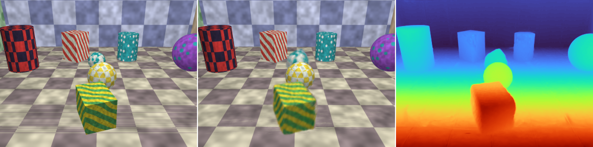

# Results

Every number of the benchmark, in detail. The short version, with pictures, is in the
[README](../README.md); the protocol (scenes, variants, metrics, profiles) is in
[BENCHMARK.md](BENCHMARK.md).

## Small-format results (`cpu` profile)

The complete benchmark at the `cpu` profile: 4 scenes x 15 variants x 3 seeds, run on a
4-core CPU without a GPU, plus the same benchmark with the depth predicted by a network
(below), 348 reconstructions in all, each of 24 frames at 128 x 96 with 800 optimisation
steps. A seed changes the layout, the textures and the camera shake of every scene; each
number is the **mean ± standard deviation over the 3 seeds**. LPIPS uses AlexNet. Depth
comes from the noisy oracle (the default of this profile, see
[BENCHMARK.md](BENCHMARK.md)) unless stated otherwise. Every metric of every
variant: [results/cpu/results.md](../results/cpu/results.md); the metrics of each run:
`results/cpu/seed*/results.json`; the commands:
[BENCHMARK.md](BENCHMARK.md#several-seeds).

*`sliding`, default pipeline, seed 0: input frame, reconstruction, rendered depth
([video](../results/cpu/figures/sliding_full_reconstruction.gif),
[orbiting camera, time frozen](../results/cpu/figures/sliding_full_bullet_time.gif)).*

**Default pipeline** (KLT + flow chaining with DIS, SfM + bundle adjustment, depth
alignment, motion segmentation, 4D Gaussians), per scene:

|  | ATE (cm) | aligned depth AbsRel (%) | PSNR held-out frames | PSNR held-out cameras | LPIPS held-out cameras | PSNR moving objects | Chamfer (cm) | 3D EPE (cm) | mask IoU |
|---|---:|---:|---:|---:|---:|---:|---:|---:|---:|
| still | 0.52 ± 0.04 | 2.6 ± 1.4 | 26.65 ± 0.74 | 23.43 ± 1.01 | 0.093 ± 0.006 | - | 7.6 ± 3.6 | - | - |
| rolling | 0.47 ± 0.04 | 2.4 ± 0.9 | 25.02 ± 0.41 | 22.36 ± 0.79 | 0.119 ± 0.009 | 17.47 ± 1.15 | 6.6 ± 2.2 | 36.2 ± 14.5 | 0.726 ± 0.019 |
| sliding | 0.60 ± 0.11 | 3.3 ± 1.5 | 25.18 ± 0.50 | 21.73 ± 1.58 | 0.121 ± 0.005 | 17.94 ± 0.29 | 8.6 ± 3.3 | 41.6 ± 14.3 | 0.769 ± 0.013 |
| squash | 0.78 ± 0.21 | 2.8 ± 0.8 | 26.16 ± 0.35 | 22.25 ± 0.91 | 0.112 ± 0.014 | 17.98 ± 0.74 | 9.1 ± 1.4 | 17.8 ± 5.9 | 0.725 ± 0.010 |

PSNR and LPIPS on held-out cameras are computed on the pixels the video observes; "moving
objects" restricts them to those objects. 3D EPE: true surface points handed to the
scene's motion field and compared with their true trajectory over the whole video.

**Where the error comes from.** One stage at a time is replaced by its ground truth,
averaged over the four scenes:

|  | PSNR held-out cameras | LPIPS held-out cameras | PSNR moving objects | Chamfer (cm) | Chamfer moving (cm) | 3D EPE (cm) | track δ_avg |
|---|---:|---:|---:|---:|---:|---:|---:|
| `full` | 22.44 ± 0.25 | 0.111 ± 0.006 | 17.80 ± 0.63 | 8.0 ± 0.6 | 12.1 ± 2.3 | 31.9 ± 7.3 | 0.429 ± 0.016 |
| `oracle-depth` | 22.50 ± 0.18 | 0.110 ± 0.004 | 17.85 ± 0.72 | 7.8 ± 0.9 | 12.2 ± 1.7 | 28.6 ± 1.4 | 0.430 ± 0.016 |
| `oracle-poses` | 23.75 ± 0.14 | 0.099 ± 0.004 | 18.15 ± 0.62 | 5.2 ± 0.1 | 10.4 ± 1.7 | 28.0 ± 7.3 | 0.430 ± 0.016 |
| `oracle-tracks` | 24.16 ± 0.12 | 0.091 ± 0.000 | 19.32 ± 0.41 | 4.4 ± 0.0 | 4.0 ± 0.3 | 6.7 ± 1.0 | 1.000 ± 0.000 |
| `oracle-all` | 24.57 ± 0.11 | 0.079 ± 0.003 | 21.03 ± 0.15 | 3.4 ± 0.0 | 2.8 ± 0.3 | 2.7 ± 0.8 | 1.000 ± 0.000 |
| `static-only` | 20.27 ± 0.25 | 0.175 ± 0.013 | 11.22 ± 0.54 | 8.3 ± 0.6 | - | 74.2 ± 0.2 | 0.483 ± 0.009 |

* **Point tracking is the bottleneck.** Exact tracks and flow (which also make the SfM
  poses exact) bring the 3D trajectory error from 32 cm to 7 cm and the moving surfaces
  from 12.1 cm to 4.0 cm. The dense tracker chains optical flow and drops points at
  occlusions (TAP-Vid δ_avg 0.43).
* Exact poses mostly help the static geometry (Chamfer 8.0 to 5.2 cm, +1.3 dB on the
  held-out cameras), although the estimated trajectory is already within 0.6 cm.
* Exact depth changes little (less than 0.1 dB): once aligned to the poses, the noisy
  depth is already within 2.8% of the truth.
* With every input exact, the moving objects (21.0 dB) remain 3.5 dB below the whole image:
  that gap belongs to the scene optimisation at this budget.
* Ignoring the motion (`static-only`, plain 3DGS) costs 2.2 dB on the held-out cameras and
  6.6 dB on the moving objects.

**Ablations**, averaged over the four scenes:

|  | aligned depth AbsRel (%) | PSNR held-out cameras | LPIPS held-out cameras | PSNR moving objects | Chamfer (cm) | 3D EPE (cm) |
|---|---:|---:|---:|---:|---:|---:|
| `full` | 2.8 ± 0.5 | 22.44 ± 0.25 | 0.111 ± 0.006 | 17.80 ± 0.63 | 8.0 ± 0.6 | 31.9 ± 7.3 |
| `no-depth-loss` | 2.8 ± 0.5 | 22.38 ± 0.24 | 0.115 ± 0.004 | 17.60 ± 0.74 | 8.2 ± 0.4 | 32.3 ± 7.0 |
| `no-track-loss` | 2.8 ± 0.5 | 22.25 ± 0.09 | 0.112 ± 0.004 | 16.36 ± 0.47 | 7.6 ± 0.5 | 31.3 ± 6.0 |
| `no-rigidity` | 2.8 ± 0.5 | 22.43 ± 0.24 | 0.115 ± 0.006 | 17.96 ± 0.57 | 8.0 ± 0.6 | 33.9 ± 5.4 |
| `no-depth-correction` | 4.1 ± 0.5 | 22.00 ± 0.17 | 0.118 ± 0.003 | 16.86 ± 0.68 | 7.7 ± 0.3 | 35.9 ± 10.6 |
| `depth-prior-ba` | 2.6 ± 1.4 | 22.37 ± 1.56 | 0.113 ± 0.009 | 17.28 ± 1.13 | 10.1 ± 5.3 | 34.7 ± 5.7 |

* The track loss is what animates the moving objects: without it they lose 1.4 dB.
* The depth correction field brings the aligned depth from 4.1% to 2.8% AbsRel (+0.4 dB on
  the held-out cameras).
* The depth loss and the rigidity regulariser make no difference larger than the spread
  over the seeds at this budget.
* The monocular depth prior in bundle adjustment does not help on average and makes the
  geometry unpredictable (Chamfer 10.1 ± 5.3 cm against 8.0 ± 0.6 cm), which is why it is
  off by default (but see the learned depth below).

**Back-ends**: one stage of the default pipeline replaced by a pretrained model or by
COLMAP, averaged over the four scenes:

|  | raw depth AbsRel (%) | ATE (cm) | RPE-r (deg) | track δ_avg | PSNR held-out cameras | PSNR moving objects | Chamfer (cm) | 3D EPE (cm) |
|---|---:|---:|---:|---:|---:|---:|---:|---:|
| `full` | 3.5 ± 0.3 | 0.59 ± 0.07 | 0.077 ± 0.003 | 0.429 ± 0.016 | 22.44 ± 0.25 | 17.80 ± 0.63 | 8.0 ± 0.6 | 31.9 ± 7.3 |
| `depth-anything` | 2.3 ± 0.1 | 0.59 ± 0.07 | 0.077 ± 0.003 | 0.431 ± 0.016 | 21.81 ± 0.24 | 16.40 ± 0.65 | 8.1 ± 0.7 | 35.0 ± 5.8 |
| `raft` | 3.5 ± 0.3 | 0.59 ± 0.07 | 0.077 ± 0.003 | 0.431 ± 0.016 | 22.10 ± 0.44 | 16.86 ± 0.48 | 8.0 ± 0.7 | 45.9 ± 10.2 |
| `cotracker` | 3.5 ± 0.3 | 0.59 ± 0.07 | 0.077 ± 0.003 | 0.832 ± 0.010 | 22.53 ± 0.17 | 18.46 ± 0.23 | 7.9 ± 0.8 | 11.0 ± 1.8 |
| `colmap` | 3.5 ± 0.3 | 2.03 ± 0.78 | 0.217 ± 0.027 | 0.423 ± 0.013 | 21.23 ± 1.37 | 16.50 ± 1.42 | 14.8 ± 8.3 | 37.1 ± 8.4 |

* **CoTracker3 removes most of the tracking error**: TAP-Vid δ_avg 0.83 against 0.43, 3D
  trajectory error 11 cm against 32 cm, +0.7 dB on the moving objects. On this CPU it
  costs about 10 minutes of tracking per run against a few seconds for flow chaining,
  which is why it is not the default here.
* RAFT (small) does worse than DIS at this resolution: 3D trajectory error 46 cm against
  32 cm, -0.9 dB on the moving objects. The `gpu` profile (384 x 288) is the fairer test.
* COLMAP is close to the track-based SfM on the static scene (ATE 0.76 against 0.52 cm);
  the gap grows with the moving objects, which COLMAP is not told about (4.4 against
  0.8 cm on `squash`).

**Depth predicted from pixels.** The default depth is a noise model of a monocular
network. Two real networks instead: Depth Anything V2 (zero-shot) as a variant of the
benchmark above, and the in-domain U-Net (`depth=learned`, the setting of the Kaggle
notebook) as the depth back-end of a second complete run, trained here on CPU for 12 epochs
instead of 40 (2400 frames of random scenes, 1.8% AbsRel on its validation scenes). Every
table of that run: [results/cpu-learned/results.md](../results/cpu-learned/results.md).

| depth back-end | raw depth AbsRel (%) | aligned depth AbsRel (%) | PSNR held-out cameras | LPIPS held-out cameras | PSNR moving objects | Chamfer (cm) | 3D EPE (cm) |
|---|---:|---:|---:|---:|---:|---:|---:|
| noisy oracle (default of the profile) | 3.5 ± 0.3 | 2.8 ± 0.5 | 22.44 ± 0.25 | 0.111 ± 0.006 | 17.80 ± 0.63 | 8.0 ± 0.6 | 31.9 ± 7.3 |
| Depth Anything V2 (small) | 2.3 ± 0.1 | 3.0 ± 0.5 | 21.81 ± 0.24 | 0.121 ± 0.002 | 16.40 ± 0.65 | 8.1 ± 0.7 | 35.0 ± 5.8 |
| in-domain U-Net | 2.1 ± 0.2 | 2.8 ± 0.4 | 22.08 ± 0.13 | 0.117 ± 0.003 | 16.57 ± 0.13 | 8.1 ± 0.6 | 39.4 ± 6.7 |
| in-domain U-Net, depth prior in BA | 2.1 ± 0.2 | 2.1 ± 0.2 | 22.54 ± 0.27 | 0.113 ± 0.002 | 16.75 ± 0.02 | 6.3 ± 0.3 | 36.6 ± 4.6 |

* Both networks beat the noise model on raw depth (2.3% and 2.1% against 3.5%) and lose
  end to end, mostly on the moving objects (-1.4 and -1.2 dB). For the U-Net the error
  sits there: 2.0% against 3.5% AbsRel on the static pixels of the three dynamic scenes,
  5.1% against 3.7% on the moving objects.
* With the U-Net, the depth prior in bundle adjustment **helps**: Chamfer 8.1 to 6.3 cm,
  +0.5 dB on the held-out cameras, aligned depth 2.8% to 2.1%, with a small spread. With
  the noise model it made the geometry unpredictable (above). It stays off by default, the
  default depth of the profile being the noise model; with a network, turn it on with
  `sfm.depth_weight=10`.
* The U-Net has to run at the size it was trained at (192 x 144): applied to the 128 x 96
  frames directly, its error on a benchmark scene went from 1.5% to 4.3% (and to 5.5% on
  the 384 x 288 frames of the `gpu` profile). The `learned` back-end now resizes the
  frames.

## Full-size results (`gpu` profile)

The benchmark at the `gpu` profile, run by [the Kaggle notebook](../notebooks/kaggle_benchmark.ipynb)
on two T4 GPUs: 4 scenes x 15 variants, one seed (seed 0, so no ±), each reconstruction of
60 frames at 384 x 288 with 7000 optimisation steps. The notebook took 11.7 hours, a
reconstruction about 22 minutes (19 of them in the optimisation). Unlike the CPU tables
above, the depth comes from a network: the in-domain U-Net (`depth=learned`), trained by
the notebook for 40 epochs (2400 frames of random scenes; on its 240 validation frames
AbsRel 1.11%, δ1 0.999). The flow is DIS, as above. The `depth-anything` and `cotracker`
variants failed in the notebook (a checkpoint mix-up and an out-of-memory error, both fixed)
and were rerun in two shorter Kaggle sessions with the same settings (`cotracker` with the
network trained by the notebook). Every table:
[results/gpu/results.md](../results/gpu/results.md); the metrics of each run:
`results/gpu/results.json`; the training log of the network:
[results/gpu/tiny_depth.json](../results/gpu/tiny_depth.json).

*`sliding`, default pipeline: input frame, reconstruction, rendered depth
([`rolling`](../results/gpu/figures/rolling_full.png),
[`squash`](../results/gpu/figures/squash_full.png)).*

**Default pipeline**, per scene:

|  | ATE (cm) | aligned depth AbsRel (%) | PSNR held-out frames | PSNR held-out cameras | LPIPS held-out cameras | PSNR moving objects | Chamfer (cm) | 3D EPE (cm) | mask IoU |
|---|---:|---:|---:|---:|---:|---:|---:|---:|---:|
| still | 0.11 | 0.9 | 31.12 | 28.55 | 0.142 | - | 3.2 | - | - |
| rolling | 0.10 | 0.8 | 27.29 | 24.13 | 0.152 | 16.82 | 2.8 | 14.0 | 0.569 |
| sliding | 0.12 | 1.3 | 26.83 | 23.38 | 0.159 | 15.98 | 4.0 | 30.8 | 0.704 |
| squash | 0.11 | 0.8 | 27.61 | 23.91 | 0.133 | 17.23 | 2.7 | 11.8 | 0.645 |

**Where the error comes from**, averaged over the four scenes:

|  | PSNR held-out cameras | LPIPS held-out cameras | PSNR moving objects | Chamfer (cm) | Chamfer moving (cm) | 3D EPE (cm) | track δ_avg |
|---|---:|---:|---:|---:|---:|---:|---:|
| `full` | 24.99 | 0.147 | 16.67 | 3.2 | 9.9 | 18.9 | 0.417 |
| `oracle-depth` | 25.67 | 0.140 | 18.05 | 2.8 | 3.5 | 7.0 | 0.418 |
| `oracle-poses` | 25.62 | 0.136 | 16.95 | 2.6 | 10.3 | 14.6 | 0.418 |
| `oracle-tracks` | 25.37 | 0.143 | 16.56 | 2.2 | 9.7 | 16.1 | 1.000 |
| `oracle-all` | 26.22 | 0.131 | 18.52 | 1.8 | 1.8 | 2.8 | 1.000 |
| `static-only` | 21.49 | 0.233 | 11.08 | 4.5 | - | 74.2 | 0.328 |

* **Point tracking is no longer the bottleneck; the depth of the moving objects is.** Exact
  tracks bring the 3D trajectory error from 18.9 to 16.1 cm; exact depth brings it to
  7.0 cm and the moving surfaces from 9.9 to 3.5 cm (+1.4 dB on the moving objects). Most
  of it is `sliding`: 30.8 cm of trajectory error and 18.8 cm on the moving surfaces with
  the network, 3.5 and 3.2 cm with exact depth, while exact tracks leave them at 25.2 and
  19.1 cm. On CPU, with the noise model as depth, exact tracks were the large gain
  (32 to 7 cm) and exact depth a small one.
* Every stage estimated is within 1.3 dB of every stage exact on the held-out cameras
  (24.99 against 26.22 dB), against 2.1 dB at the `cpu` profile. The camera trajectory is
  within 0.11 cm.
* Ignoring the motion (`static-only`) costs 3.5 dB on the held-out cameras and 5.6 dB on
  the moving objects.

**Ablations**, averaged over the four scenes:

|  | aligned depth AbsRel (%) | PSNR held-out cameras | LPIPS held-out cameras | PSNR moving objects | Chamfer (cm) | 3D EPE (cm) |
|---|---:|---:|---:|---:|---:|---:|
| `full` | 1.0 | 24.99 | 0.147 | 16.67 | 3.2 | 18.9 |
| `no-depth-loss` | 1.0 | 24.41 | 0.153 | 15.69 | 3.9 | 19.0 |
| `no-track-loss` | 1.0 | 24.47 | 0.160 | 15.48 | 3.2 | 19.3 |
| `no-rigidity` | 1.0 | 24.70 | 0.147 | 16.00 | 3.2 | 28.1 |
| `no-depth-correction` | 1.3 | 24.89 | 0.150 | 16.53 | 3.2 | 16.3 |
| `depth-prior-ba` | 1.2 | 24.48 | 0.149 | 16.48 | 3.7 | 16.2 |

* The depth prior in bundle adjustment does **not** help here: -0.5 dB on the held-out
  cameras and Chamfer 3.2 to 3.7 cm, the 3D trajectory error going from 18.9 to 16.2 cm.
  At the `cpu` profile it helped with the network (Chamfer 8.1 to 6.3 cm); with one seed
  at this profile, the default (off) stays.
* The rigidity regulariser matters more than at the `cpu` profile: without it the 3D
  trajectory error goes from 18.9 to 28.1 cm. Without the depth loss the static geometry
  degrades (Chamfer 3.2 to 3.9 cm, -0.6 dB); without the track loss the moving objects
  lose 1.2 dB.
* The depth correction field changes the aligned depth less than at the `cpu` profile
  (1.3% to 1.0%), the network depth being already close to the truth.

**Back-ends**, averaged over the four scenes:

|  | raw depth AbsRel (%) | ATE (cm) | RPE-r (deg) | track δ_avg | PSNR held-out cameras | PSNR moving objects | Chamfer (cm) | 3D EPE (cm) |
|---|---:|---:|---:|---:|---:|---:|---:|---:|
| `full` | 1.2 | 0.11 | 0.012 | 0.417 | 24.99 | 16.67 | 3.2 | 18.9 |
| `depth-anything` | 2.7 | 0.11 | 0.012 | 0.416 | 23.82 | 15.20 | 4.1 | 20.9 |
| `raft` | 1.2 | 0.11 | 0.012 | 0.292 | 24.54 | 16.28 | 3.8 | 34.9 |
| `cotracker` | 1.2 | 0.11 | 0.012 | 0.885 | 24.80 | 16.49 | 3.1 | 15.5 |
| `colmap` | 1.2 | 0.60 | 0.065 | 0.410 | 24.61 | 16.57 | 3.8 | 15.5 |

* CoTracker3 tracks far better than flow chaining (TAP-Vid δ_avg 0.89 against 0.42) but
  gains less than at the `cpu` profile: 3D trajectory error 15.5 against 18.9 cm (11
  against 32 cm on CPU), and 0.2 dB less on the held-out cameras and on the moving objects.
  Exact tracks do no better (16.1 cm, above): with the network depth, the tracks are not
  what limits the motion. On a T4 it adds about 12 minutes of tracking per run and, on its
  denser tracks, 18 minutes of motion segmentation (against 20 s and 1.3 minutes).
* RAFT (small) is still worse than DIS at 384 x 288: track δ_avg 0.29 against 0.42, 3D
  trajectory error 34.9 against 18.9 cm, -0.5 dB on the held-out cameras.
* Depth Anything V2 (small) is behind the in-domain network (raw AbsRel 2.7% against
  1.2%, -1.2 dB on the held-out cameras), as at the `cpu` profile.
* COLMAP poses: ATE 0.60 against 0.11 cm and -0.4 dB on the held-out cameras.

**Rasteriser against gsplat.** The pure-PyTorch rasteriser and gsplat's CUDA rasteriser
render the same 30000 Gaussians at 384 x 288 to within 1.4e-3 (PSNR 83 dB between the two
images with this project's default support, 72 dB when it also bounds every Gaussian at 3
standard deviations); the gradients agree with a cosine similarity of 0.999999. gsplat is
about 30 times faster on the forward pass (0.6 ms against 20 ms):
[results/gpu/gsplat_check.json](../results/gpu/gsplat_check.json).

**Not run yet.** The `gpu` profile with several seeds (one run of the notebook is about
12 GPU-hours). CoTracker3 was not combined with the learned depth on CPU (12 more runs of
about 10 minutes each); at the `gpu` profile it was (above).
